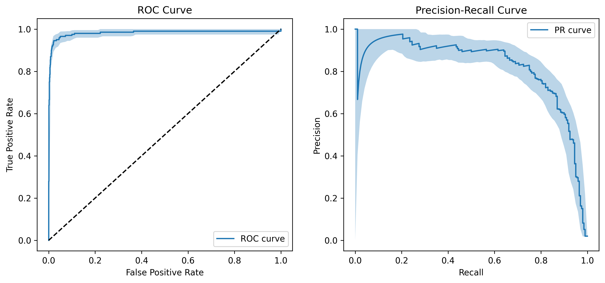
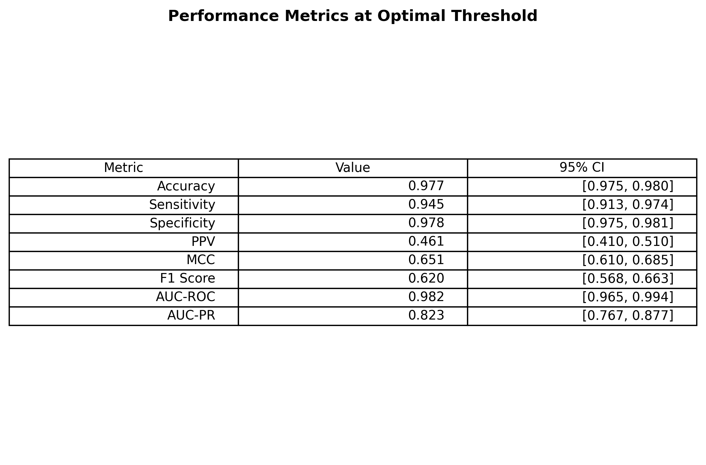

[](https://github.com/kitamura-felipe/omnibin/actions/workflows/test.yml)
[](https://github.com/kitamura-felipe/omnibin/actions/workflows/deploy.yml)


# Omnibin

A comprehensive Python package for generating detailed machine learning evaluation reports with visualizations, confidence intervals, and statistical analysis. Supports **binary classification**, **regression**, **segmentation**, and **object detection** tasks with a focus on healthcare applications.

## Try it Online

You can try Omnibin directly in your browser through our [Hugging Face Space](https://felipekitamura-omnibin.hf.space).

## Installation

```bash
pip install omnibin
```

## Features

### Report Types

| Report Type | Use Case | Key Metrics |
|------------|----------|-------------|
| **Binary Classification** | Disease diagnosis, risk prediction | AUC-ROC, AUC-PR, Sensitivity, Specificity, PPV, NPV |
| **Regression** | Continuous value prediction (e.g., tumor size, survival time) | MAE, RMSE, R², Bland-Altman analysis |
| **Segmentation** | Medical image segmentation (tumors, organs) | Dice Score, IoU, Hausdorff Distance, Surface Distance |
| **Detection** | Lesion/nodule detection | mAP, FROC Score, Precision-Recall at various IoU |

### Common Features

- Comprehensive PDF reports with multiple visualizations
- 95% confidence intervals via bootstrapping
- Multiple color schemes (Default, Monochrome, Vibrant)
- Reproducible results with random seed control
- Healthcare-optimized metrics (Bland-Altman, FROC, etc.)

---

## Usage

### Binary Classification

```python
import numpy as np
from omnibin import generate_binary_classification_report, ColorScheme

# Your data
y_true = np.array([0, 1, 1, 0, 1, ...])  # Binary labels
y_scores = np.array([0.2, 0.8, 0.9, 0.1, 0.7, ...])  # Predicted probabilities

report_path = generate_binary_classification_report(
    y_true=y_true,
    y_scores=y_scores,
    output_path="classification_report.pdf",
    n_bootstrap=1000,
    random_seed=42,
    dpi=300,
    color_scheme=ColorScheme.DEFAULT
)
```

**Metrics Included:**
- Accuracy, Sensitivity (Recall), Specificity
- Positive/Negative Predictive Value (PPV/NPV)
- Matthews Correlation Coefficient (MCC)
- F1 Score, AUC-ROC, AUC-PR

**Visualizations:**
- ROC and Precision-Recall curves with confidence bands
- Metrics vs. threshold plots
- Confusion matrix at optimal threshold
- Calibration plot
- Prediction distribution

---

### Regression

```python
import numpy as np
from omnibin import generate_regression_report, RegressionColorScheme

# Your data
y_true = np.array([10.5, 20.3, 15.2, ...])  # Actual values
y_pred = np.array([11.2, 19.8, 14.9, ...])  # Predicted values

report_path = generate_regression_report(
    y_true=y_true,
    y_pred=y_pred,
    output_path="regression_report.pdf",
    n_bootstrap=1000,
    random_seed=42,
    dpi=300,
    color_scheme=RegressionColorScheme.DEFAULT
)
```

**Metrics Included:**
- Mean Absolute Error (MAE)
- Mean Squared Error (MSE), Root MSE (RMSE)
- R² and Adjusted R²
- Mean Absolute Percentage Error (MAPE)
- Explained Variance
- Normalized RMSE, CV-RMSE

**Visualizations:**
- Scatter plot with regression line
- Residual plots (vs. predicted, histogram)
- Q-Q plot for normality assessment
- **Bland-Altman plot** (essential for medical agreement studies)
- Error distribution histograms
- Prediction intervals

---

### Segmentation

```python
import numpy as np
from omnibin import generate_segmentation_report, SegmentationColorScheme

# Your 2D or 3D segmentation masks
y_true = np.load("ground_truth_mask.npy")  # Binary mask
y_pred = np.load("predicted_mask.npy")     # Binary mask

report_path = generate_segmentation_report(
    y_true=y_true,
    y_pred=y_pred,
    output_path="segmentation_report.pdf",
    n_bootstrap=500,
    random_seed=42,
    dpi=300,
    color_scheme=SegmentationColorScheme.DEFAULT
)
```

**Metrics Included:**
- **Dice Score** (Sørensen–Dice coefficient)
- **IoU / Jaccard Index**
- Pixel Accuracy
- Sensitivity and Specificity
- Precision (PPV)
- Volumetric Similarity
- **Hausdorff Distance** (and 95th percentile)
- **Average Surface Distance**

**Visualizations:**
- Side-by-side comparison (GT vs. Prediction vs. Overlay)
- Pixel-wise confusion matrix
- Metrics bar chart
- Surface distance histograms
- Per-slice Dice distribution (for 3D data)

**Multi-class Segmentation:**
```python
from omnibin import generate_multiclass_segmentation_report

report_path = generate_multiclass_segmentation_report(
    y_true=y_true,
    y_pred=y_pred,
    output_path="multiclass_report.pdf",
    class_names={1: "Tumor", 2: "Edema", 3: "Necrosis"}
)
```

---

### Object Detection

```python
from omnibin import generate_detection_report, DetectionColorScheme

# Predictions: list of predictions per image
predictions = [
    [{"box": [10, 10, 50, 50], "score": 0.9}, {"box": [60, 60, 100, 100], "score": 0.7}],  # Image 1
    [{"box": [20, 20, 80, 80], "score": 0.85}],  # Image 2
    []  # Image 3 (no detections)
]

# Ground truths: list of boxes per image
ground_truths = [
    [[12, 12, 48, 48], [65, 65, 95, 95]],  # Image 1
    [[25, 25, 75, 75]],                     # Image 2
    [[30, 30, 70, 70]]                      # Image 3
]

report_path = generate_detection_report(
    predictions=predictions,
    ground_truths=ground_truths,
    output_path="detection_report.pdf",
    n_bootstrap=500,
    iou_thresholds=[0.5, 0.75]
)
```

**Metrics Included:**
- Average Precision at various IoU (AP@50, AP@75)
- Mean Average Precision (mAP)
- **FROC Score** (Free-Response ROC - medical imaging standard)
- Precision, Recall, F1 at IoU=0.5
- Detection Rate
- Average False Positives per Image

**Visualizations:**
- Precision-Recall curves at different IoU thresholds
- **FROC curve** (Sensitivity vs. FP/Image)
- IoU distribution histogram
- Confidence score distributions (TP vs. FP)
- Detections per image analysis

**Lesion Detection (Healthcare Focus):**
```python
from omnibin import generate_lesion_detection_report

# Optimized for medical imaging with FROC as primary metric
report_path = generate_lesion_detection_report(
    predictions=predictions,
    ground_truths=ground_truths,
    output_path="lesion_detection_report.pdf",
    use_distance=False,  # Use IoU-based matching
    distance_threshold=None
)
```

---

## Color Schemes

All report types support three color schemes:

| Scheme | Description |
|--------|-------------|
| `DEFAULT` | Professional blue-based palette |
| `MONOCHROME` | Grayscale for publications |
| `VIBRANT` | High-contrast colorful palette |

---

## Input Formats

| Report Type | Input Format |
|------------|--------------|
| Classification | `y_true`: 0/1 array, `y_scores`: 0-1 probability array |
| Regression | `y_true`: continuous array, `y_pred`: continuous array |
| Segmentation | 2D or 3D NumPy arrays (binary masks) |
| Detection | Lists of dicts with `box` and `score` keys |

---

## Example Outputs

### Binary Classification



### Regression
- Scatter plot with regression line
- Bland-Altman agreement plot
- Q-Q plot for residual normality

### Segmentation
- Ground Truth / Prediction / Overlay comparison
- Dice score distribution across slices

### Detection
- FROC curve (standard for medical imaging)
- Precision-Recall at multiple IoU thresholds

---

## Requirements

- Python >= 3.11
- NumPy, Pandas, Scikit-learn, Matplotlib, SciPy, Seaborn

---

## License

MIT License - see LICENSE file for details.
